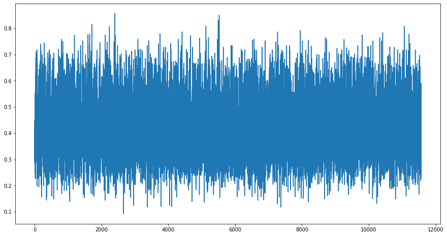

# EDA on QUAC

This has three notebooks as of now covering topic modelling using BERT and another on showing how to use the data.

I have added a `boilerplate.py` which can be used to easily load the data and make the code resuable.
Just upload the `boilerplate.py` using drag and drop in Colab which loads the file in a second.

You can use `get_data("squad")` to get your squad2.0 dataset
Or use `get_data("quac")` to get the quac dataset.
While running this function, you might get an error in the first run, please try to run the cell again and the error should be removed.

`data_to_dataframe(dataset)` converts the data directly to a pandas dataframe.
If you get an error while running this, run this code cell again and the error should be gone.

I haven't added comments right now, so let me know if you use the same boilerplate, then I can add comments.

There are a few more functions I will add later on for lemmatization, stemming etc which has been done in the bertopic modelling notebook so that the code can be reused.

---

`first_ques_eda.ipynb` - EDA on the first question of each context along with removal of stop words and lemmatization. Bertopic is fitted on context concatenated with background, wiki_page and section_title.

`quac_bertopic_modelling.ipynb` - the vanilla bertopic visualization notebook

`quac_eda2.ipynb` - EDA on all the questions along with bertopic visualization

`quac_word2vec.ipynb` - EDA done using the word2vec for the context of QUAC.

---
# Analysis

## Dataset Analyzed: QUAC
### Topic model before removing stop words and lemmatization
**Note**: This topic modelling has been done all questions for each context.

---

## Topic Model after removing stop words and lemmatization
### Here onwards, only the first question of each context has been taken. Then, the context has been concatenated by background, wiki_page and section_title.

---

#### Inferences:
- Number of topics increased from 59 -> 79. Unfortunately, it seems like BerTopic is not reproducible as the topics clustered seems to change after running it every time. No significant inference based on number of topics. But now, the corpus in each clusters are of each of nearly same frequency i.e. 500. 
- Number of documents that were not clustered have increased a little bit but again, this number changes as it is not reproducible. 
- Intertopic modelling graph looks better spatially clustered but this cannot be confirmed as the high dimensional space might be clustered in a similar manner and still a lot of similar topics are clustered near the same region.
**Note**: Spell check and correction wasn't performed as there are flaws when typos are being corrected might change the semantics of the sentence. Screenshot of the errors found with ContextualSpellCheck

The proportion of misspelt words are extremely less on QUAC so this should not hamper our topic modelling.

---

##### Distribution of Similiarity measure (top 1 out of the list of 5) for each question returned by the Topic Model

##### Overall Distribution of Similarities

###### Density Plot of Similarities

##### Mean Similarity Value: ``0.417022``

|Threshold Similarity Value| Number of questions dropped in the original dataset|
|:---|:---|
|0.1| 1|
|0.2| 139|
|0.3| 1845|
|0.31| 2157|
|0.32| 2485|
|0.33| 2845|
|0.34| 3335|
|0.35| 3742|
|0.4| 5588|
|0.5| 8817|
|0.6| 10624|
|Total|11567|

##### Inferences: 
Looking at the above table, a threshold of 0.3-0.35 seems to be an ideal choice which has been found to be true for SQUAD too.
**Note**: This second inference has been done on significantly less data of questions as only the first question has been chosen.
